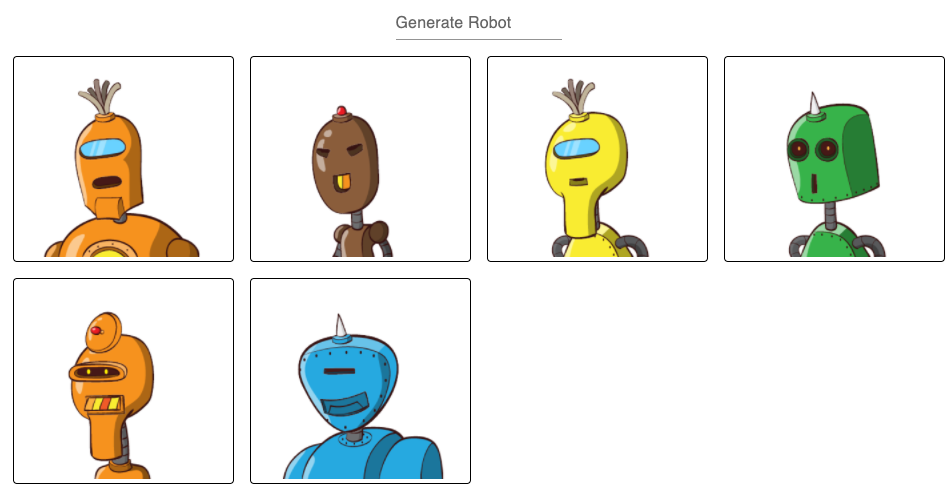

# Griffeye React Challenge

## Instructions

Write a component that includes an input field and and a
submit button, below it, a list of images. At the start, the list
should be empty. When the user submits some string input-string, the
function should append the robot image corresponding to that string
to the current list of images.

|  |
|:--:|
| <b>example image: https://robohash.org/hello</b>|

The service provides unique images for any text. For example, put
https://robohash.org/hello in your browser and you’ll see the image
above. Put any other string, and you’ll see a different image. 

When a user clicks on a robot image, the image should be removed from the
list. Finally, if you are inclined to take on styling details,
We use [MUI](https://mui.com/getting-started/usage/) to style our products so if you want, 
use the input field from there and center the form and display the robot list
as a grid. 
After entering many a few robots, the page should look something like this:

|  |
|:--:|
| <b>example solution image</b>|

## Participate
To complete the challenge just click the link below to fork this project on stackblitz and code away:
[Fork on StackBlitz ⚡️](https://stackblitz.com/fork/react-ts-af86rk)
when you're happy with the solution just make sure you save it and send the link over to us.
